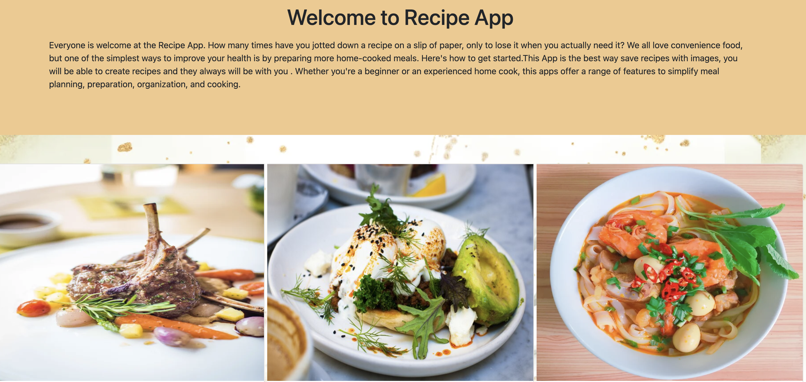
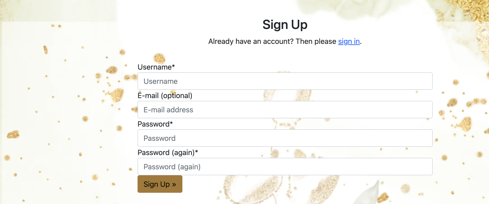
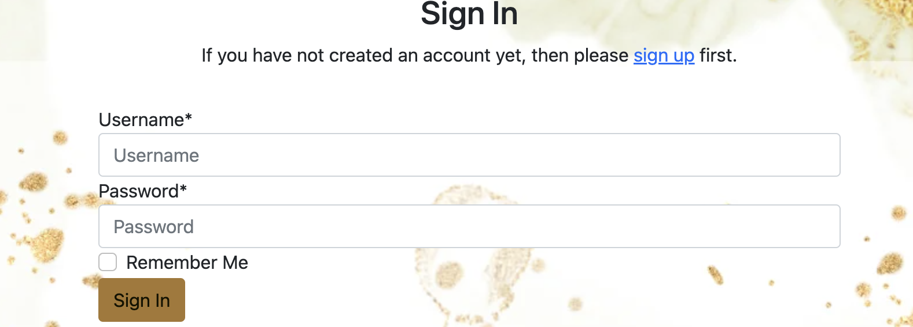
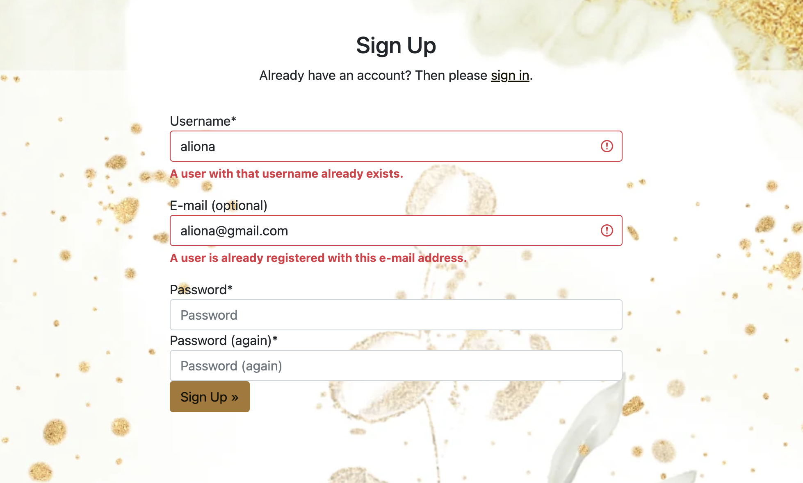
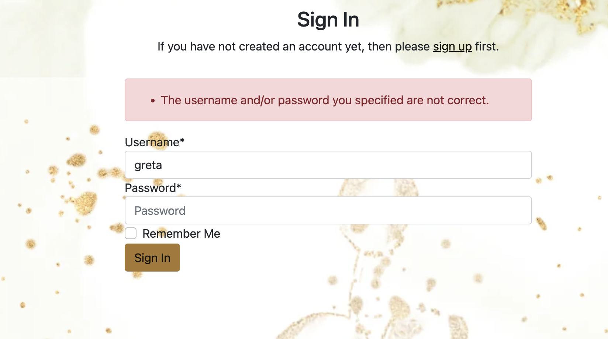
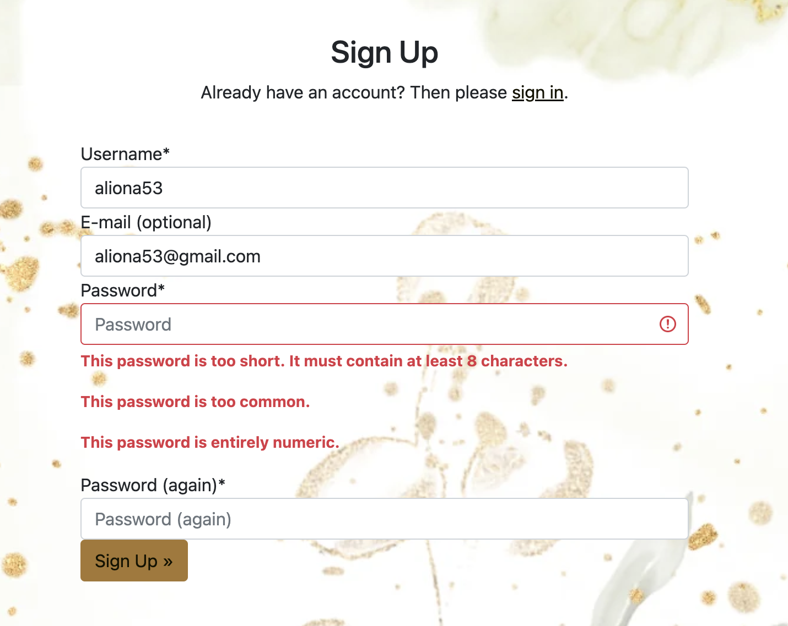
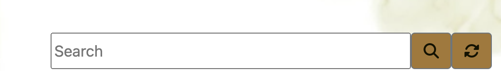

# Table of contents

  * [Recipe Book](#recipe-book)
  * [Project goals](#project-goals)
  * [UX](#ux)
     * [User stories](#user-stories)
  
  * [Features ](#features)
      * [Navigation](#navigation-bar)
      * [Home page](#home-page)
      * [Registration page](#registration-page)
      * [Log In / Log Out page](#registration-page)
      * Recipe library
         * Search bar 
         * Paginations  
         * Like button
      * Add recipe page
  * Design
     * Colours
     * Typography
     * Media
     * Wireframes
  * [Testing](#)  
  * [Deployment](#deployment) 
# Recipe Book 
*** 
Recipe Book is a web app that I was building using the Django Full Stack Framework. The Recipe Book app is that allows users to be able to create new recipes, add changes for each recipe and save or delete them. By creating this app, I aimed to make it as simple as possible, so that users can use it anytime and anywhere. Every new user will have to register to become a user of this app. Users need to be logged in to get the full functionality of the app. 
(Click here) to visit Live Site

# Project Goals

This application was created for people who love to cook. In creating this project my goal was to make the app easy to use. My goal was that this application could be used not only by adults but also by younger children who are just starting to learn how to cook. They can delete recipes, improve them, and add images.

# UX
 ## User Stories 
 ***

My Project was developed with agile planning. I had three columns: To Do, In Progress, and Done. This helps me to manage my project and helps me to be more flexible and adaptable to changes.
Below are the User stories that were used in creating this project. I add 8 EPIC with labels MUST, SHOULD-HAVE.

[Link for User stories](https://github.com/Aliona83/project4--test/issues)

Click to see more

1 EPIC - Home Page and Navigation Bar

    * As a Site User I can easily navigate around the site so that I can view different pages. As a Site User, I want to see a home page with basic information about the app.
2 EPIC - Account registration 

    * As a Site User I want to be able to create an account and log in into my app with my username and password.

3 EPIC - Add CRUD functionality

    * As a Site User I want to add recipes.
    * As a Site User I want to update recipes.
    * As a Site User I want to delete recipes from my recipe page. 

4 EPIC - Create Recipe Form 

   * As a Site User I want to have a recipe form where I will be able to add all ingredients, and instructions, sort by meal type and be able to add an image of the recipe.

5 EPIC - Recipe page
    
   * As a Site User I want to have a separate page where I will be able to see all recipes that I save.

6 EPIC - Pagination 

   * As a Site User I want to see a number of pages in recipe page. 

7 EPIC - Search Bar 
   
   * As a Site User I want to be able search my recipes by ingredients and by type of meals(breakfast, lunch and dinner)

# Features  
  ***

Click to see more

 ## Navigation Bar
 

 The navigation menu consists of Logo, register and Log In. The App logo was created by Canvas and is a simple Chef's cap with the text Recipe App. By clicking on the Logo, user can always return to the Home page. 
 If the User is new, he will have to register, and if the User already exists, he can easily Log In to his recipe page. When User Log in, some links on the navigation bar will change, and the user will be able to see the recipe library, add a new recipe and Log Out. Once User logged In it will see welcome back text with his name. 

 

 Also on the small screen the navigation menu will be changed to the burger menu which shows all the navigation links.
 

 ## Home Page

 The home page has a welcome message and a short description of the application. At the bottom are three bright images of a recipe with the small guide on what users can do with this app.
 ## Registration page
  
Django allauth was installed and used to create the Sign-Up, Login, and Log Out functionality and pages
   * Sign UP

The user has to fill up the fields in the registration form: username, email, and password. If the User already exists they can click on the top page Sign In button, and will be transferred to the log-in form.
 
   * Log In

Log in form is similar to Sign up, only has a few fields username and a password. If the User forgotten to register as a new user,on the top of the Sign Up page there is a Sign Up link were the user can Sign Up. 
 
   * Success/unsuccess messages 

Success messages inform the user if they already have an account, enter the wrong password or username or enter the short password by creating a new account user.
 
 
 

 ## Recipe library

   * Search Bar

     

   * Pagination

    

   * Like button
   
    
1
 ## Add Recipe page

## Testing !!!!(change link)

[Link to wireframes](https://github.com/Aliona83/project4--test/tree/main/readmeDocumentation/wireframes)

Details of all testing done can be viewed in depth in the [Testing.md](https://github.com/Aliona83/project4--test/tree/main/readmeDocumentation/screenshot) document. 
 # Deployment

Heroku's Hosting Service
1. Login or create an account at Heroku.
2. On the homepage you select the 'New' button and then select 'Create New App' from the drop-down.
3. Give your app a unique name and choose your relevant region.
4. In the 'Settings' tab of your app select 'Reveal Config Vars'.
5. Add a value for 'SECRET_KEY' connecting to your django environment.
6. Add a value for 'DATABASE_URL' connecting to your postgreSQL database.
7. Add a value for 'ClOUDINARY_URL' connecting to cloudinary's cloud hosting service for media.
8. Proceed down to the 'Buildpack' section and select 'Add buildpack' before choosing Python and 'Save Changes'.
9. Back at the top of the page select the 'Deploy' tab.
10. Select GitHub as preferred deployment method, confirm connecting to Github if not automatic.
11. Connect to your relevant repository on GitHub.
12. You can now select either 'Automatic Deployment' for deployment on every push to GiHub or 'Manual Deployment' for only when you press this button.

Final Deployment
1. Create a runtime.txt python-3.8.13.
2. Ensure a procfile is created with the following web: gunicorn projectnamehere.wsgi.
3. Ensure DEBUG = False in settings.py.

To Clone
You can clone this project by executing the following:
1. Open this project on GitHub here.
2. You will be provided with three options to choose from, HTTPS, SSH or GitHub CLI, click clipboard in order to copy.
3. Once selected, the forked project will be in your repositories.
4. Open up a new terminal.
5. Adjust the current directory to be the location you wish the cloned directory to be.
6. Type 'git clone' and paste the URL copied above in step 2.
7. Hit 'Enter' and the project will be successfully cloned.

To Fork
1. Open this project on GitHub here.
2. The fork button is found at the top of the page.
3. The forked project will be in your repositories.

## Technologies Used
* Git Used for version control alongside GitHub.
* GitHub Used in conjunction with Gitpod as the code editor, to store the project and utilise git version control.
* Heroku Used to deploy and host the finished product.
* Cloudinary Used as cloud based storage, storing any submitted media in the deployed application.
* ElephantSQL Used to host the PostgreSQL database for the application.
* W3C - HTMLUsed to validate all HTML code.
* W3C - CSS Used to validate all CSS code.
* CI PEP8 Testing Used to validate all Python code.
* Google Fonts Used to provide the fonts used in application styling.
* Bootstrap Used to aid implementation of styling and responsiveness.
* Fontawesome Used to implement effective icons.
* Google Chrome Dev Tools Used during the development to debug and test responsiveness.
* Balsamiq Used to build both the database schema diagram and design wireframes.
     
## Credits    
* Stack Overflow
* bbcgoodfood
* 