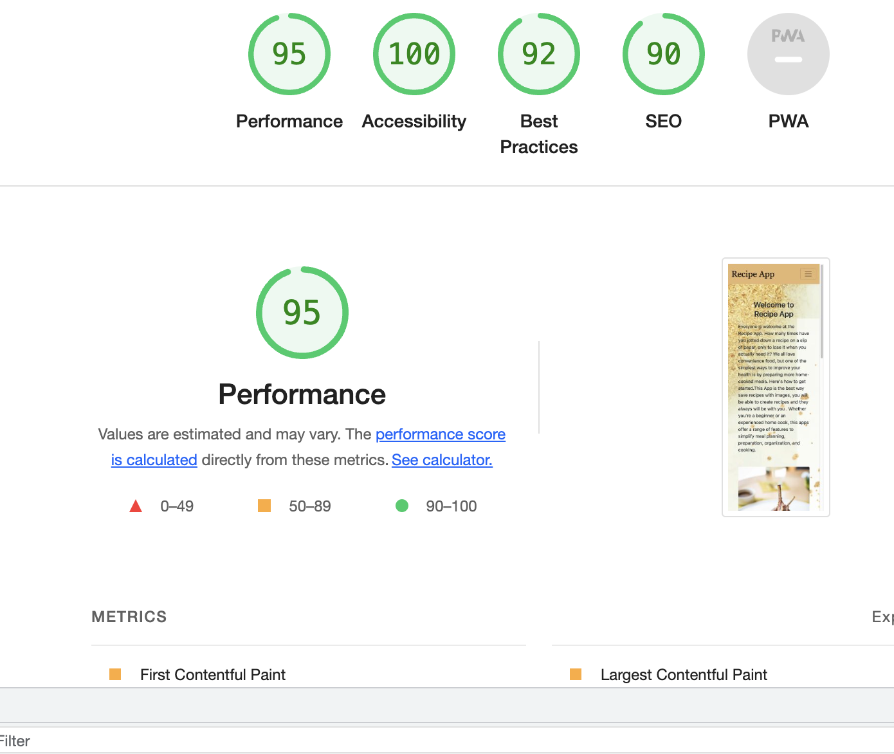
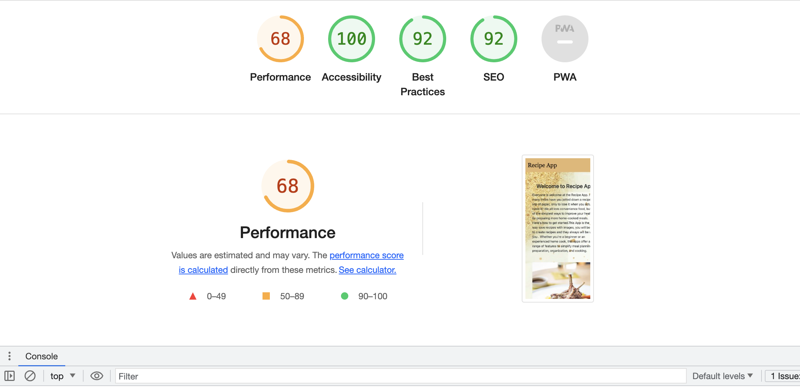

# Table of Contents
 * [Validator Testing](#validator-testing)
   * HTML
   * CSS
   * PYTHON
   * LIGHTHOUSE
   * GTMETRIX 
   * Ax Dev Tools

 * [Device Testing](#)
    * IMac
    * Samsung Galaky Tablet
    * Iphone 6
    * Iphone 11
    * Chrome
    * Firefox

* [Manual Testing](#manual-testing)
* Bugs

# Validator Testing
  ## HTML
  * Home page
  
  * Add recipe page
  
  * Recipe library page
  
  * Register page
  
  * Log In
  
  * Each recipe page
  

 ## CSS 
  ## Python

## Lighthouse
  * Desktop
  
  
  * Mobile
  
 
 ## Add Recipe page
   * Desktop
   
   * Mobile 
   

  ## Recipe Library
   * Desktop 
   
   * Mobile 
   

  ## Register Page 
   * Desktop 
   
   * Mobile 
   
  
  ## Each Recipe Page
   * Desktop 
   
   * Mobile 
   

   ## Log In
    * Desktop 
   
    * Mobile 
   
   ## Log Out
    * Desktop 
   
    * Mobile 
   

  
 
   # Manual Testing

Click to see more

| Feature       |           Test Performed    |             Result           |        
|:--------------|:--------------------------- |:---------------------------  |
|                        Navigation                                        |
| Logo          | Clicked on Logo to check or redirect to the home page| Pass |
| Home button   | Clicked on the Home button from different pages to check or redirect to the home page| Pass  | 
| Add recipe    | Clicked on Add recipe link brings the User to the  Add recipe page | Pass |
| Register      | When clicking on the register link, brings the User to the registration page | Pass |
| Small screens |  Checked that on smaller devices changes to the burger menu | Pass |
| Recipe Library| Clicked recipe library link to check or will open a page with all recipes | Pass | 
| Log In        | Clicked on the log-in link that will bring the User to the login page  | Pass |
| Log Out       | Clicked on the log-out link that will bring the User to log out page | Pass |
|                                                         Footer                      |
| Small screens |       Checked that all media links are visible on small devices | Pass |                                |
| Media  Links  | Clicked on each media link opens a new page   | Pass |
| Footer is on
 all pages      | Check all pages how the footer looks   | Pass |
|                     Add Recipe Page                     |
| Try to create a new recipe with blank fields | For this test, I want to make sure that empty fields won't let to save the recipe and return the user to empty fields.|Pass |
| View form on different sizes of devices | Check how will look add recipe form on tablets and phones, make sure all form fields are easy to see and use| Pass. |
| Save new recipe | Recipe was successfully saved with the image. and I filled out all the fields| Pass|
|                          Recipe library                                                |
| Search bar functionality | Enter different ingredients and meal types, all recipes were found from the recipe library that was searched in the search bar| Pass |
| Pagination | Test all the links should be functional by clicking on the numbers, next and previous buttons | Pass |
| View each recipe | By clicking on a recipe title link should open the recipe with full instructions and ingredients.| Pass |
| Delete recipe| By clicking on the delete button the User should be able to delete the recipe from the recipe library | Pass |
| Update recipe | By clicking on the button update recipe user will be able to make changes to the recipe and successfully save it| Pass|
| Like button | By clicking on the like button(heart) user will be able to like the recipe which he likes, heart has to be red if a user liked the recipe| Fail|
| Check how the page works on small devices | Check that page looks good and is able to use on tablets and phones| Pass |
| Success messages |After deleting, update and adding recipe User gets messages/feedback| Pass |
|Check authentication | User able to Sign Up, log in and log out | Pass |

